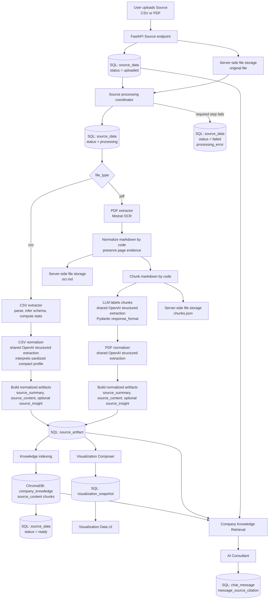
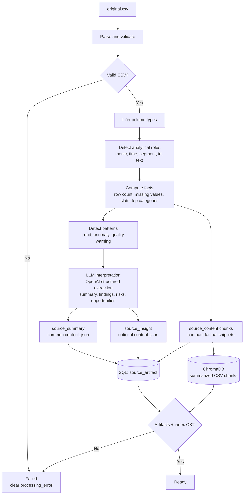
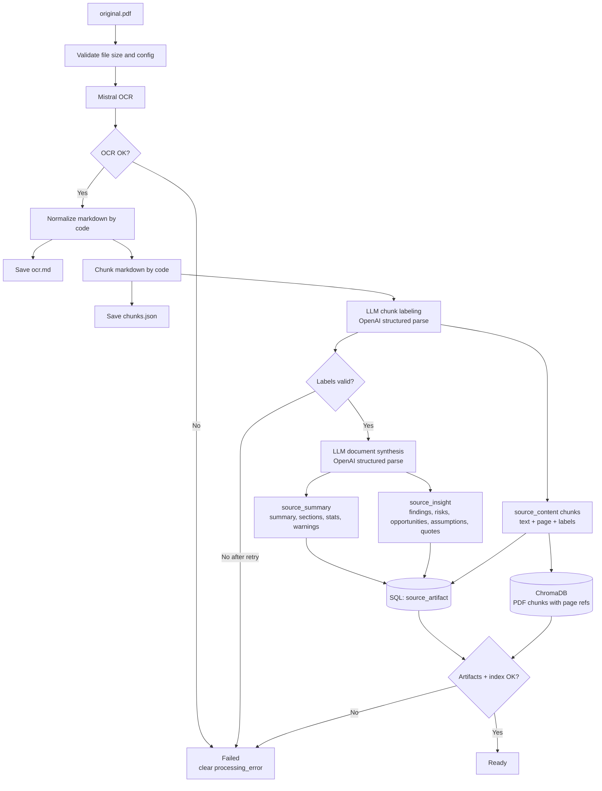
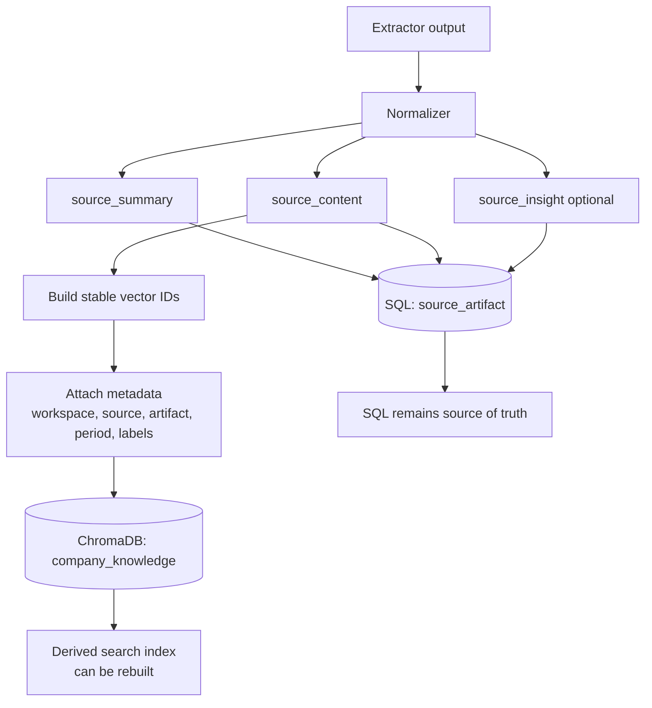
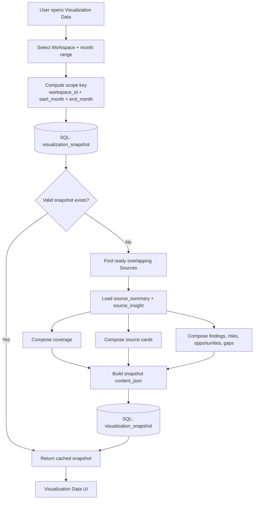
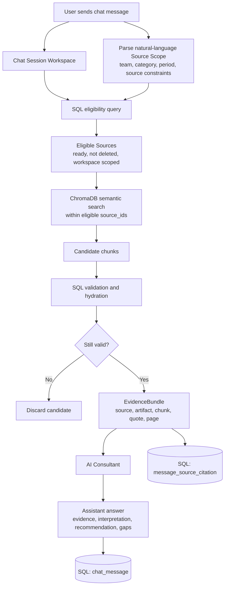
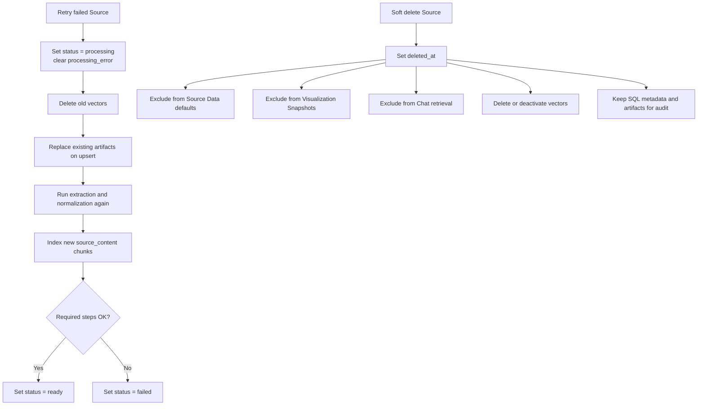
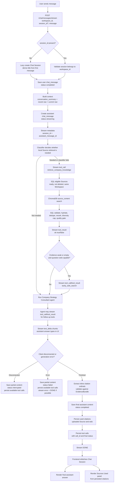
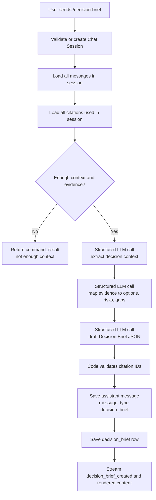

# Architecture: Source Data end-to-end

This document is the current source of truth for how the app turns uploaded Sources into stored knowledge, Visualization Data, and grounded Chat evidence.

## Core decisions

- Source processing runs synchronously by default. Redis/Celery may be added later as optional infrastructure.
- File type only affects extraction. The product treats every uploaded file as a Source.
- A ready Source must produce normalized knowledge artifacts.
- SQL remains the source of truth. ChromaDB is a derived search index.
- Visualization Data is a cached, period-based composed view over many ready Sources.

## Data stores

```text
SQL DB
  source_data         Source identity, metadata, period, lifecycle
  source_category     Multi-select category labels
  source_artifact     Normalized Source knowledge
  visualization_snapshot Cached period-based Visualization Data view

Server-side file storage
  storage/uploads/{workspace_id}/{source_id}/original.{ext}
  storage/extracted/{workspace_id}/{source_id}/ocr.md
  storage/extracted/{workspace_id}/{source_id}/chunks.json

ChromaDB
  company_knowledge   Searchable source_content chunks
```

Server-side file storage is not browser `localStorage`. It stores original uploads and extracted files needed for retry, audit, and re-indexing.

## End-to-end flow diagrams

### 1. Full Source ingestion and usage flow



### 2. CSV extraction and normalization flow



CSV uses code for arithmetic and LLMs for interpretation. It does not index every raw row.

### 3. PDF extraction and normalization flow



Markdown normalization preserves evidence. LLMs label and synthesize; they do not rewrite the full OCR text.

### 4. Artifact and indexing flow



`source_content` is the bridge between Source Artifacts and ChromaDB. Chat can search ChromaDB, but it must validate results against SQL before use.

### 5. Visualization Snapshot flow



Visualization Data has no team, category, or file type filters in MVP. Team and category labels appear as grouping context inside the snapshot.

### 6. Chat retrieval and citation flow



VectorDB is never trusted as the source of truth. It proposes candidates; SQL validates Workspace, Source status, soft-delete state, and artifact existence.

### 7. Retry and soft-delete flow



## Source lifecycle

```text
uploaded -> processing -> ready | failed
```

A Source becomes `ready` only when all required downstream stores are consistent:

- the original file is saved;
- `source_summary` is stored in SQL;
- `source_content` is stored in SQL;
- `source_content.chunks` are indexed in ChromaDB when the Source is indexable;
- no blocking processing error remains.

`source_insight` is recommended but not required. If useful insight cannot be generated, processing should store a warning instead of inventing insight.

## Period model

Sources use month-level periods only.

```text
period_start_month = "YYYY-MM"
period_end_month   = "YYYY-MM"
```

`period_label` is derived by the backend for display. Users do not type it. Examples:

- `2026-01` to `2026-01` -> `Jan 2026`
- `2026-01` to `2026-03` -> `Q1 2026`
- `2026-02` to `2026-03` -> `Feb-Mar 2026`
- `2026-01` to `2026-12` -> `2026`

Month ranges overlap when:

```text
source.period_start_month <= requested.period_end_month
AND source.period_end_month >= requested.period_start_month
```

## Source artifacts

`source_artifact` stores normalized knowledge generated from a Source.

Artifact types:

```text
source_summary   Required. Overview of what the Source contains.
source_content   Required for indexable Sources. Searchable and citation-ready chunks.
source_insight   Optional. Findings, risks, opportunities, assumptions, and quotes.
```

Retired artifact types:

```text
csv_profile
chart_spec
insight_card
visualization_spec
```

Visualization is no longer a per-Source artifact. It is composed from many Source artifacts.

### Common `content_json` envelope

All artifact types use the same top-level shape. Sections may be empty when they do not apply.

```json
{
  "summary": "",
  "statistics": {
    "row_count": null,
    "column_count": null,
    "page_count": null,
    "chunk_count": null
  },
  "columns": [],
  "sections": [],
  "findings": [],
  "risks": [],
  "opportunities": [],
  "assumptions": [],
  "quotes": [],
  "chunks": [],
  "warnings": [],
  "metadata": {}
}
```

## CSV processing

CSV processing is code-first and LLM-second.

Code handles facts:

- parse and validate the CSV;
- infer column data types;
- compute row count, column count, missing values, numeric stats, date ranges, and top categories;
- detect analytical roles such as metric, time dimension, segment dimension, identifier, and text;
- detect obvious trends, anomalies, and data quality warnings.

The LLM interprets computed facts via shared OpenAI structured extraction (`apps/api/app/services/llm_extraction.py`):

- LLM input uses sanitized compact profile data with no local file paths and no raw sample cell values;
- write a business-readable summary;
- turn detected patterns into findings, risks, opportunities, and assumptions;
- produce retrieval-friendly prose chunks for `source_content`.

CSV `source_content` should not index every raw row. It should index compact, factual snippets from the profile, statistics, and insights.

## PDF processing

PDF processing uses OCR, conservative normalization, chunking, shared OpenAI structured extraction for labeling, and shared OpenAI structured extraction for synthesis.

```text
PDF
  -> Mistral OCR
  -> normalized markdown by code
  -> chunks by code
  -> chunk labels by shared OpenAI structured extraction (Pydantic response_format)
  -> source_summary/source_insight by shared OpenAI structured extraction
  -> source_content by code from chunks + labels
  -> ChromaDB index
```

Markdown normalization is code, not LLM. It preserves evidence, adds page markers, normalizes whitespace, and avoids rewriting source text. Chunk labeling and synthesis use `client.chat.completions.parse()` with Pydantic `response_format` — no direct LiteLLM JSON calls or manual JSON repair.

Chunk labels use two concepts:

- `document_section`: where the chunk belongs in the document, such as `executive_summary`, `market_context`, `competitor_analysis`, `financials`, `risks`, `opportunities`, `recommendation`, `appendix`, or `unknown`.
- `content_type`: what kind of information the chunk contains, such as `narrative`, `metric`, `table`, `quote`, `assumption`, `risk`, `opportunity`, `recommendation`, or `raw_text`.

Each useful PDF finding should include a quote and page number when available. Unsupported claims become assumptions or warnings.

## VectorDB indexing

All `source_content.chunks` are indexed in ChromaDB when indexable.

- CSV: summarized factual chunks, not all raw rows.
- PDF: OCR chunks with page references and chunk labels.
- Future visual formats: extracted text and visual element descriptions.

ChromaDB owns embeddings via the collection `embedding_function`. Indexing uses `collection.upsert(documents=..., ids=..., metadatas=...)` and retrieval uses `collection.query(query_texts=[query], ...)`. There is no manual app-generated embedding step and no `knowledge/embeddings.py` runtime path.

Embedding config: `RAG_EMBEDDING_API_BASE_URL` (default `https://api.openai.com/v1`), `RAG_EMBEDDING_API_KEY`, `RAG_EMBEDDING_MODEL` (default `text-embedding-3-small`).

RAG structuring config: `RAG_OPENAI_API_BASE_URL` (default `https://openrouter.ai/api/v1`), `RAG_OPENAI_MODEL` (default `google/gemini-2.5-flash-lite`).

Chroma collection:

```text
company_knowledge
```

Vector IDs should be stable:

```text
source:{source_id}:artifact:{artifact_id}:chunk:{chunk_index}
```

Required metadata:

```text
workspace_id
source_id
artifact_id
chunk_id
source_title
file_type
team_label
category_labels
period_start_month
period_end_month
content_type
document_section
page_number
row_refs
columns
created_at
```

Chat retrieval must validate VectorDB results against SQL before using them as evidence.

## Chat retrieval

Chat uses one retrieval facade:

```text
retrieve_company_knowledge(workspace_id, query, source_scope)
```

The facade:

1. queries SQL for eligible Sources;
2. searches ChromaDB within those Source IDs;
3. validates and hydrates results from SQL;
4. returns an evidence bundle with Source, artifact, chunk, quote, and page references.

Eligible Sources must be ready, not deleted, and scoped to the chat session's Workspace. Natural-language scope may narrow by team, category, period, or source constraint per message.

## Chat page backend architecture

Chat is the primary intelligence surface. It is streaming-first, Workspace-scoped, source-grounded by default, and able to use web evidence only when uploaded Source evidence is weak or missing for a public/current question.

### Chat session behavior

- Opening the Chat page renders a local draft conversation. It does not create a backend Chat Session immediately.
- The backend lazily creates a Chat Session on the first user message.
- A Chat Session is permanently scoped to the Workspace used at creation time.
- If the user opens an old Chat Session from history and sends a new message, the message is appended to that same session.
- History dropdown loads the latest 5 sessions first and uses offset-based Show More.
- Session title is derived from the first user message by trimming whitespace, removing line breaks, and truncating to a short display length.
- `last_message_at` is updated whenever a user or assistant message is saved.

### Chat context window strategy

Normal Chat is full-session-aware. The backend loads all messages in the Chat Session, then builds a bounded model context through a ContextBuilder.

The model should not receive only the latest user message, because that loses conversation continuity. It also should not receive unlimited raw history, because long noisy sessions increase cost, exceed token limits, and can make answers less reliable.

ContextBuilder policy:

```text
all session messages
  -> older messages summarized into conversation_summary
  -> recent messages included raw
  -> current user message included raw
```

Recommended MVP settings:

```text
recent_messages_raw = latest 10 messages before the current user message
conversation_summary max = 1,000-1,500 tokens
```

The Chat Session stores summary state:

```text
chat_session.conversation_summary nullable text
chat_session.summary_cutoff_message_id nullable
chat_session.summary_updated_at nullable
```

Meaning:

- `conversation_summary` summarizes messages up to `summary_cutoff_message_id`.
- Messages after the cutoff are passed raw if they are in the recent window.
- When messages move out of the recent window, the summary is refreshed to include them.
- The current user message is always included raw.

Context order for normal Chat:

```text
system grounding rules
conversation_summary
recent raw messages
current user message
uploaded Source EvidenceBundle
web evidence, only if Tavily fallback is allowed and used
```

Because Chat also uses RAG, ContextBuilder owns the total prompt budget across conversation context, retrieved uploaded Source evidence, optional web evidence, and reserved output tokens. It must not let RAG chunks crowd out the current user message or grounding rules, and it must not let long conversation history crowd out source evidence.

Budgeted context assembly:

```text
total model context budget
  - system grounding rules
  - conversation_summary
  - recent raw messages
  - uploaded Source EvidenceBundle
  - Tavily web evidence, if allowed and used
  - current user message
  - reserved output tokens
```

Always reserve output capacity before assembling the prompt. Recommended MVP reserve:

```text
normal chat output reserve = 1.5x-2x expected answer length
decision brief output reserve = 1.5x-2x expected draft length
```

When budget is tight, preserve context in this priority order:

```text
1. system grounding rules                 never drop
2. current user message                   never drop
3. high-quality uploaded Source evidence  primary factual grounding
4. recent raw messages                    conversational continuity
5. conversation_summary                   compressed continuity
6. Tavily web evidence                    only when allowed and needed
7. lower-ranked RAG chunks                drop first
8. older/redundant raw messages           drop after weak chunks
```

`conversation_summary` should be refreshed before the prompt is near the hard context limit. Recommended trigger:

```text
refresh summary around 70-80% of context capacity
```

### RAG evidence budget and ordering

The retrieval layer should return a compact EvidenceBundle, not large raw artifacts.

Normal Chat RAG limits:

```text
top_k = 8-12 final evidence chunks
max chunks per Source = small diversity cap, e.g. 2-3
```

Retrieval pipeline before prompt injection:

```text
ChromaDB candidate search
  -> SQL validate Workspace, Source status, soft-delete state, artifact/chunk existence
  -> deduplicate near-identical chunks
  -> rerank by relevance
  -> apply diversity cap per Source
  -> apply retrieval quality gate
  -> inject only compact final EvidenceBundle
```

Evidence item shape should be citation-ready:

```text
citation_id
source title or web title
quote/snippet
page number or row refs
content_type/document_section where available
relevance_score
why relevant, if computed
```

Do not inject weak or misleading RAG chunks just to fill context. If retrieval quality is low, mark evidence insufficient, use Tavily only when the question is web-capable, or answer with gaps.

Lost-in-the-middle mitigation:

- Keep evidence compact.
- Avoid excessive chunk counts.
- Put a short evidence overview before detailed chunks when useful.
- Keep the strongest evidence near the model's attention anchors instead of burying it in the middle of a long prompt.
- Keep the current user message near the end of the assembled context.

Citation validation:

```text
LLM returns used_citation_ids
backend validates used_citation_ids are a subset of provided EvidenceBundle IDs
backend saves only validated citations actually used in the final answer
```

If the model references a citation ID that was not provided, the backend must reject or repair the response before persistence.

Important grounding rule:

```text
conversation_summary is context, not evidence.
Internal company factual claims still require uploaded Source citations.
Web citations can support external or market context only.
```

If summary refresh fails, the response can still proceed with recent raw messages and evidence, but the model must not invent missing earlier context.

### Chat message lifecycle

`chat_message` stores final message state, not every stream event.

```text
pending -> streaming -> completed
pending -> failed
streaming -> interrupted
```

- User messages are stored as `completed` immediately.
- Assistant messages are created as `streaming` before token output starts.
- If generation finishes, the assistant message becomes `completed` and `completed_at` is set.
- If generation fails before any useful output, the assistant message becomes `failed`.
- If generation fails after partial output, the assistant message becomes `interrupted`; partial content is retained for audit and UI recovery.

### Chat streaming protocol

The backend streams Server-Sent Events as `text/event-stream` with JSON objects in `data:` lines. Each JSON event uses a `type` field. The stream ends with the DeltaKit-compatible sentinel `data: [DONE]`.

Do not use named SSE `event:` fields for the MVP contract.

The backend uses `StreamingResponse` and manually formats SSE lines. Native browser `EventSource` is not used because the Chat stream endpoint is a POST with a JSON request body; the frontend reads the stream with `fetch` and a `ReadableStream` parser.

OpenAI Agents SDK stream events are internal Python events, not the frontend wire format. The backend converts them into DeltaKit SSE events before sending them to the browser.

Example stream:

```text
data: {"type":"metadata","session_id":12,"assistant_message_id":34,"created_session":true}

data: {"type":"tool_call","tool_name":"retrieve_company_knowledge","call_id":"call_1"}

data: {"type":"tool_result","call_id":"call_1","ok":true}

data: {"type":"text_delta","delta":"The main risk is..."}

data: [DONE]
```

Stream event types:

```text
metadata     Sends session_id, assistant_message_id, and created_session.
text_delta   Appends streamed assistant text.
tool_call    Shows a server-side tool invocation.
tool_result  Shows the server-side tool result summary.
error        Sends a safe failure message before DONE when possible.
```

`tool_call` events expose only `tool_name` and `call_id`; they do not expose tool arguments. `tool_result` events expose status only. Tool errors are sent as safe error messages. The stream must not expose private model reasoning, prompts, raw retrieved chunks, Tavily raw results, secrets, or full tool arguments.

Normal Chat does not stream these older lifecycle events:

```text
session_created
user_message_saved
assistant_started
sources_used
web_sources_used
assistant_completed
assistant_interrupted
```

The database owns those lifecycle states. Sources Used is derived after `[DONE]` by refetching the Chat Session and reading persisted `message_source_citation` rows.

### Normal chat response flow



Chat runs a small LLM classifier before pre-retrieval. The classifier uses OpenAI structured parse with Pydantic `RetrievalClassification(needs_retrieval, reason)` to decide if local Source retrieval is needed. If the message needs uploaded company evidence, or if classification fails, the backend retrieves company knowledge before the consultant agent answers. The consultant agent also has the retrieval tool available during the run. It may answer without local retrieval for clearly off-context chat, but it must not invent unsupported internal facts.

### Tavily web search policy

Tavily is the MVP web search provider. Web search is allowed only when both are true:

```text
uploaded Source evidence is weak or empty
AND the question is public, current, market-facing, or generally answerable from the web
```

Web search must not be used to fabricate internal company facts, replace uploaded Sources for Source-specific questions, or bypass Workspace boundaries.

Recommended Tavily defaults:

```text
max_results = 5
search_depth = basic
include_answer = false
include_raw_content = false
include_images = false
include_favicon = true optional
include_usage = true optional
```

Map Tavily fields into citations:

```text
title          -> citation title
url            -> citation url
content        -> citation snippet
score          -> relevance_score
published_date -> published_date
request_id     -> provider_request_id
```

### Citation model

The current DB table may keep the historical name `message_source_citation`, but conceptually it stores message citations from either uploaded Sources or web results.

```text
message_source_citation
  id
  message_id
  citation_type: uploaded_source | web
  ordinal

  source_id nullable
  artifact_id nullable
  chunk_id nullable

  url nullable
  title nullable
  domain nullable
  provider nullable
  provider_request_id nullable
  published_date nullable
  favicon_url nullable

  quote nullable
  snippet nullable
  page_number nullable
  row_refs_json nullable
  relevance_score nullable
  citation_status
  retrieved_at nullable
  created_at
```

Validation rules:

- `uploaded_source` citations require `source_id`.
- `web` citations require `url` and should not set `source_id`.
- Only evidence actually used in the final answer is saved as a citation.
- Retrieved-but-unused candidates are not shown as Sources Used.
- Old citations remain visible for audit even if their Source is later deleted or reprocessed.

Citation status values:

```text
available
source_deleted
source_failed
artifact_missing
web_unavailable
```

In the UI, uploaded Source citations and web citations can both appear under Sources Used, but web citations must be clearly labeled as Web Source.

### Decision Brief Draft flow

Decision Brief Draft generation is explicit. It only runs when the user sends `/decision-brief`.

For MVP, Decision Brief generation is not an autonomous agent workflow. It is a deterministic backend workflow that uses structured LLM calls only for extraction, evidence assessment, and drafting.

Decision Brief can reuse `conversation_summary` for efficiency, but it must remain full-session-aware. If the session is too long, the workflow should process messages in chunks and merge structured extraction results rather than silently ignoring older decision context.

Decision Brief generation uses the current Chat Session conversation and the citations already used in that session. It does not run broad retrieval across all Sources again.



If there is not enough conversation context or cited evidence, return:

```text
Belum ada context yang cukup untuk membuat Decision Brief Draft.
Diskusikan keputusan, opsi, risiko, dan evidence terlebih dahulu, lalu jalankan /decision-brief lagi.
```

Each `/decision-brief` creates a new point-in-time draft. Drafts are not overwritten and do not auto-update when the conversation continues.

```text
decision_brief
  sequence_number
  context_cutoff_message_id
```

`context_cutoff_message_id` records the last message included in the draft context.

### Decision Brief status changes

Decision Brief Approval Status is changed from actions on the Decision Brief card in Chat, not through `/brief-status` in the MVP.

Allowed transitions:

```text
draft -> reviewed
draft -> approved
draft -> rejected
reviewed -> approved
reviewed -> rejected
approved = locked
rejected = locked
```

Backend endpoint:

```text
PATCH /decision-briefs/{brief_id}/status
```

The endpoint must validate that the Decision Brief belongs to the requested Workspace and Chat Session context before updating status.

## Visualization Composer

Visualization Data is a period-based intelligence snapshot. It is not a per-Source artifact.

Input scope:

```text
workspace_id
period_start_month
period_end_month
```

No team, category, or file type filters are used in Visualization Data. Team and category remain metadata for grouping and display.

Flow:

```text
request period view
  -> compute scope key
  -> return valid visualization_snapshot if present
  -> otherwise compose from ready overlapping Sources
  -> save snapshot
  -> return snapshot
```

Snapshot key:

```text
workspace_id + period_start_month + period_end_month
```

`visualization_snapshot` is cache, not source of truth. It can be rebuilt from `source_data` and `source_artifact`.

Snapshot content should include coverage, source cards, key findings, risks, opportunities, gaps, and evidence references.

## Service boundaries

```text
services/sources.py
  Source CRUD, save upload, soft delete, retry, lifecycle orchestration

services/source_processing.py
  Load Source, choose extractor, run normalizer, upsert artifacts, index content

services/llm_extraction.py
  Shared OpenAI structured extraction using client.chat.completions.parse() with Pydantic response_format.
  Provides extract_structured(), extract_chunk_label(), extract_aggregate(),
  extract_csv_content(), extract_csv_insight() and related Pydantic schemas.
  Replaces direct LiteLLM JSON calls and manual JSON repair.

services/extractors/csv_extractor.py
  Parse CSV, infer schema, compute stats, detect patterns

services/extractors/pdf_extractor.py
  OCR, normalize markdown, chunk, label chunks

services/normalizers/csv_normalizer.py
  Convert CSV facts into source_summary/source_insight/source_content

services/normalizers/pdf_normalizer.py
  Convert PDF chunks and labels into source_summary/source_insight/source_content

services/artifacts.py
  Upsert, fetch, and replace Source Artifacts

services/periods.py
  Parse months, validate ranges, derive labels, test overlap

knowledge/indexing.py
  Index source_content chunks and delete old vectors on retry/delete

knowledge/retrieval.py
  Chat-facing retrieval facade

services/visualizations.py
  Visualization Composer and snapshot cache
```

## Retry and delete behavior

Retry is user-triggered only via `POST /sources/{source_id}/retry-processing`. There is no Celery auto-retry/backoff. Retry is idempotent:

- clear `processing_error`;
- set status to `processing`;
- replace artifacts for the Source;
- delete old vectors;
- re-extract, re-normalize, and re-index;
- set `ready` or `failed`.

Soft delete sets `deleted_at`. Deleted Sources are excluded from new Source Data lists, Chat retrieval, and Visualization snapshots. SQL metadata and artifacts remain for audit. Vector chunks should be deleted or made inactive so they cannot appear in future retrieval.

## Implementation order

1. Add month-period helpers and schema changes.
2. Replace artifact enum values with `source_summary`, `source_content`, and `source_insight`.
3. Realign CSV extraction and normalization.
4. Realign PDF extraction and normalization.
5. Implement ChromaDB indexing for all `source_content` chunks.
6. Implement Visualization Composer with `visualization_snapshot` cache.
7. Route Chat through `knowledge/retrieval.py`.
