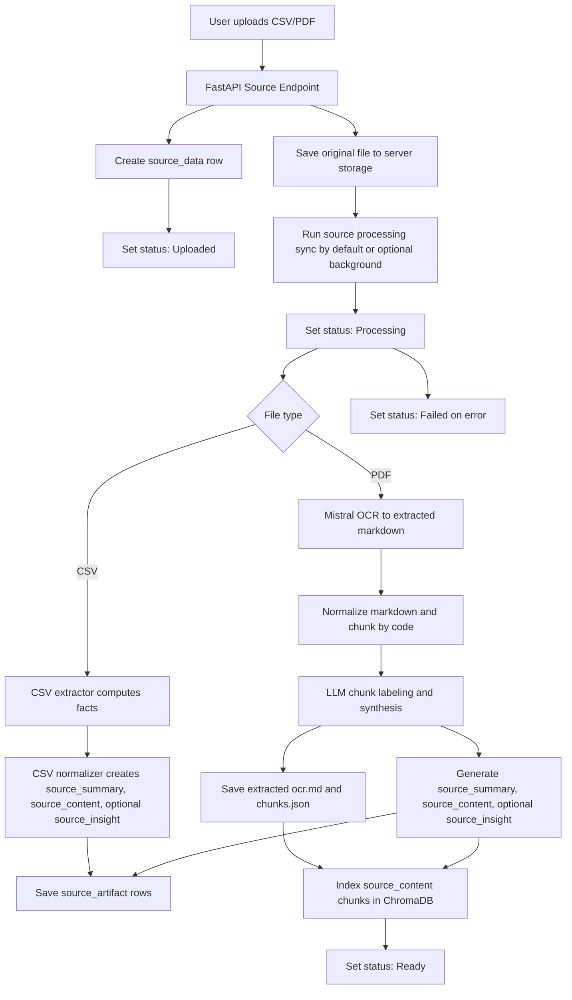
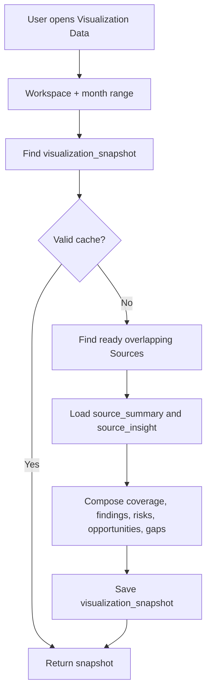
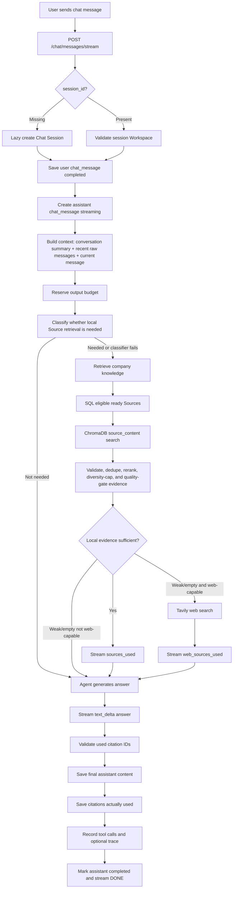
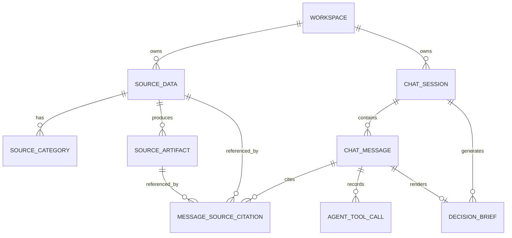

# PRD: Company Intelligence Copilot

For the current Source Data processing architecture, use [`docs/architecture.md`](architecture.md) as the source of truth.

## Problem Statement

Companies often collect product, marketing, data analysis, and business information in separate places. Marketing may own user behavior reports, product teams may own feature and roadmap documents, data analysts may prepare monthly datasets, and business teams may own market, competitor, revenue, and business model documents.

Because those sources are fragmented, teams struggle to turn company knowledge into product decisions. A founder, product lead, or business team member may need to ask: “What changed this month?”, “What source supports this recommendation?”, “Which feature should we build next?”, “What are the risks?”, or “Can this become a decision brief?” Today, answering those questions requires manual review across spreadsheets, PDFs, analytics exports, and stakeholder notes.

For the final project MVP, the team needs a focused web app that demonstrates a strong AI use case without overbuilding a full enterprise platform. The app should show how source data can become a company knowledge base, how AI can reason over that knowledge, and how users can discuss strategy with an AI consultant grounded in uploaded sources.

## Solution

Company Intelligence Copilot is a chat-first company intelligence workspace. It lets a user upload monthly company source data, label that data by team, category, and period, visualize structured data automatically, summarize unstructured documents, and discuss all available sources with an AI Company Strategy Consultant.

The MVP has three main navigation items:

- Chat
- Visualization Data
- Source Data

The Chat page behaves like a GPT-style strategy workspace. The AI is not only a passive assistant. It acts as a Company Strategy Consultant that can analyze source data, challenge assumptions, compare options, recommend product or feature initiatives, identify risks, and generate a formatted Decision Brief inside the chat when asked.

The Visualization Data page turns ready Sources into a cached, period-based intelligence view. It composes normalized Source Artifacts across CSV and PDF Sources instead of treating each file type as a separate product model.

The Source Data page is the Single Source of Truth for uploaded company context. Users can add CSV and PDF files, choose team labels, choose one or more category labels, set a month-level period, and track processing status. CSV and PDF files are extracted through file-specific processors, then normalized into shared `source_summary`, `source_content`, and optional `source_insight` artifacts.

The backend uses FastAPI as the API layer, Python for AI/RAG/data processing, SQLModel and Alembic for relational app data, ChromaDB as the vector database for searchable `source_content`, optional Redis and Celery for later background file processing, an OpenAI-compatible LLM client for consultant responses and structured workflows, Tavily for bounded web search fallback, and Langfuse for observability. The frontend uses TanStack Start, TanStack Router, React, TypeScript, and DeltaKit for chat streaming.

## User Stories

1. As a founder, I want to upload company source data, so that the AI can understand my company context.
2. As a founder, I want to ask strategic questions in chat, so that I can discuss product and business decisions with an AI consultant.
3. As a founder, I want AI answers to reference source data, so that I can trust the recommendation.
4. As a founder, I want the AI to challenge assumptions, so that I do not blindly follow weak ideas.
5. As a founder, I want the AI to highlight missing data, so that I know what information is needed before making a decision.
6. As a founder, I want to generate a Decision Brief in chat, so that I can turn discussion into a shareable decision artifact.
7. As a product team member, I want to upload product and feature documents, so that the AI can understand current delivered features and product direction.
8. As a product team member, I want to ask which feature should be prioritized, so that I can evaluate decisions using available evidence.
9. As a product team member, I want to compare multiple product initiatives, so that I can understand trade-offs.
10. As a product team member, I want to ask the AI to identify risks in a feature idea, so that I can validate before building.
11. As a product team member, I want the AI to connect product information with business and market context, so that feature decisions are not based only on internal opinion.
12. As a product team member, I want a Decision Brief to include success metrics, so that the team knows how to evaluate whether a decision works.
13. As a product team member, I want a Decision Brief to include Go, No-Go, or Validate First status, so that next steps are explicit.
14. As a marketing team member, I want to upload user behavior or campaign analytics exports, so that marketing signals become part of company intelligence.
15. As a marketing team member, I want structured CSV data to be visualized automatically, so that I do not need to manually create charts for every upload.
16. As a marketing team member, I want the AI to find trends and anomalies from uploaded data, so that unusual performance changes are easier to notice.
17. As a marketing team member, I want the AI to explain changes in plain language, so that non-technical stakeholders can understand the data.
18. As a data analyst, I want to upload prepared CSV datasets, so that the app can visualize and analyze monthly source data.
19. As a data analyst, I want uploaded datasets to have clear labels and periods, so that the AI can use the right data for the right question.
20. As a data analyst, I want file processing status, so that I know whether the source is ready for analysis.
21. As a data analyst, I want failed processing states to be visible, so that I can retry or replace invalid files.
22. As a business team member, I want to upload market research PDFs, so that the AI can use market evidence in strategic discussion.
23. As a business team member, I want to upload competitor analysis PDFs, so that feature recommendations can consider external market positioning.
24. As a business team member, I want to upload business model documents, so that the AI can understand assumptions behind the company strategy.
25. As a business team member, I want PDF documents to become insight boards, so that long documents are easier to review.
26. As a business team member, I want PDF insight boards to show assumptions and risks, so that hidden business constraints are easier to identify.
27. As a business team member, I want source quotes from PDFs, so that AI summaries can be checked against the original document.
28. As a user, I want to classify a source by team label, so that source ownership remains clear.
29. As a user, I want to classify a source by category label, so that source purpose remains clear.
30. As a user, I want category labels to support multi-select, so that one source can represent more than one kind of company knowledge.
31. As a user, I want to assign a period to each source, so that monthly and range-based questions have context.
32. As a user, I want to filter Visualization Data by team, so that I can focus on sources from a specific function.
33. As a user, I want to filter Visualization Data by category, so that I can inspect a specific type of company knowledge.
34. As a user, I want to filter Visualization Data by period, so that I can inspect data for a specific month or range.
35. As a user, I want CSV files to produce executive summary cards, so that the most important metrics are visible quickly.
36. As a user, I want CSV files to produce trend visualizations when time columns exist, so that changes over time are easy to see.
37. As a user, I want CSV files to produce segment breakdowns when category columns exist, so that performance differences across groups are visible.
38. As a user, I want CSV files to produce relationship views when numeric columns exist, so that possible correlations can be explored.
39. As a user, I want CSV files to produce anomaly highlights, so that spikes, drops, or outliers are easy to identify.
40. As a user, I want CSV files to produce auto insight cards, so that charts are explained in plain language.
41. As a user, I want PDF files to produce document summaries, so that I can understand the document quickly.
42. As a user, I want PDF files to produce key findings, so that important points are surfaced.
43. As a user, I want PDF files to produce assumptions, so that the AI can reason about business or market beliefs.
44. As a user, I want PDF files to produce risks, so that potential issues are visible before decisions are made.
45. As a user, I want PDF files to produce opportunities, so that possible product or business initiatives can be identified.
46. As a user, I want PDF files to include source quotes, so that insight boards remain grounded in the document.
47. As a user, I want the AI to auto-select relevant sources in chat, so that I do not need to manually configure every prompt.
48. As a user, I want to override source scope in chat, so that I can ask questions about a specific team, category, or period.
49. As a user, I want chat responses to show which sources were used, so that I understand the basis of the answer.
50. As a user, I want chat responses to show a Langfuse trace link, so that AI behavior is observable during the demo.
51. As a user, I want chat responses to be semi-structured, so that strategic answers are easy to scan.
52. As a user, I want chat responses to include a direct answer, so that I can quickly understand the conclusion.
53. As a user, I want chat responses to include evidence, so that recommendations are grounded.
54. As a user, I want chat responses to include interpretation, so that I understand strategic meaning.
55. As a user, I want chat responses to include recommendations or next steps, so that discussion becomes actionable.
56. As a user, I want chat responses to include confidence and gaps, so that I understand uncertainty.
57. As a user, I want the AI to state when data is insufficient, so that it does not hallucinate certainty.
58. As a user, I want the AI to label assumptions, so that unsupported claims are clear.
59. As a user, I want the AI to highlight contradictions between sources, so that the team can resolve conflicting evidence.
60. As a user, I want Decision Briefs to be generated as formatted chat responses, so that the MVP stays simple without a separate brief management workflow.
61. As a user, I want Decision Briefs to include context and problem, so that the decision has a clear starting point.
62. As a user, I want Decision Briefs to include source evidence, so that recommendations can be audited.
63. As a user, I want Decision Briefs to include strategic interpretation, so that evidence is connected to business meaning.
64. As a user, I want Decision Briefs to include alternatives considered, so that trade-offs are visible.
65. As a user, I want Decision Briefs to include risks and assumptions, so that the team knows what might be wrong.
66. As a user, I want Decision Briefs to include success metrics, so that the team can measure outcomes later.
67. As a user, I want Decision Briefs to include next steps, so that discussion leads to action.
68. As a user, I want Decision Briefs to include decision status, so that the team knows whether to Go, No-Go, or Validate First.
69. As a developer, I want a deep source ingestion module, so that file upload, metadata capture, and status transitions are testable in isolation.
70. As a developer, I want a deep CSV profiling module, so that visualization metadata can be generated through a stable interface.
71. As a developer, I want a deep PDF knowledge indexing module, so that document extraction, chunking, embedding, and retrieval can be tested independently.
72. As a developer, I want a deep chat orchestration module, so that AI routing, tool usage, source grounding, and response formatting are encapsulated.
73. As a developer, I want shared contracts between frontend and backend, so that UI and API expectations remain consistent.
74. As a developer, I want background processing for files, so that large uploads do not block the user interface.
75. As a developer, I want Langfuse traces for agent runs, so that AI behavior can be inspected during development and demo.

## Implementation Decisions

- Product name for the MVP is Company Intelligence Copilot.
- The app is chat-first. The Chat page is the primary interaction surface.
- The AI role is Company Strategy Consultant, not a generic chatbot.
- The main navigation is limited to Chat, Visualization Data, and Source Data.
- Real authentication is out of scope for MVP. The app supports basic multi-workspaces without user accounts, so the team can create separate workspaces for Developer 1, Developer 2, Developer 3, and Demo.
- Workspace management is intentionally lightweight: users can create and switch the client-selected active workspace from the app header/dashboard area, but Workspace is not a dedicated sidebar menu.
- The active workspace is client UI state, not a server-global `is_active` flag. Workspace-scoped API requests send an explicit `workspace_id`.
- Supported file types for MVP are CSV and PDF.
- Excel is not directly supported in MVP; users can export spreadsheets to CSV before upload.
- Source data is labeled by team, category, and period.
- Team labels are Marketing, Product, Data Analysis, and Business.
- Category labels are Analytics / Metrics, Market Research, Product / Feature, Customer Insight, Business Model, Competitor Analysis, and Revenue / Sales.
- Category labels support multi-select.
- Visualization Data is scoped by Workspace and month range only. Team and category labels remain Source metadata for grouping and Chat scope, not Visualization filters.
- File processing uses four statuses: Uploaded, Processing, Ready, and Failed. Processing runs synchronously by default for the demo and can later use background jobs.
- Structured CSV data is parsed, profiled, interpreted, and normalized into shared Source Artifacts.
- CSV processing uses deterministic code for facts and an LLM for business-readable interpretation.
- CSV `source_content` indexes summarized factual chunks, not every raw row.
- Unstructured PDF data is not forced into charts.
- PDF processing generates `source_summary`, `source_content`, and optional `source_insight` with key findings, assumptions, risks, opportunities, and source quotes.
- PDF OCR uses Mistral OCR with model `mistral-ocr-latest`, inline base64 document input, `table_format="html"`, and image base64 disabled.
- PDF structuring uses LiteLLM with `RAG_OPENAI_API_BASE_URL`, `RAG_OPENAI_API_KEY`, and `RAG_OPENAI_MODEL`, defaulting to `google/gemini-3.1-flash-lite-preview`.
- PDF processing writes extracted markdown to `storage/extracted/{workspace_id}/{source_id}/ocr.md` and chunk metadata to `storage/extracted/{workspace_id}/{source_id}/chunks.json`.
- Source processing runs synchronously by default for the demo. `RAG_ENABLE_BACKGROUND_PROCESSING=false` keeps sync processing; when enabled later, background failures should fall back to sync processing with a warning.
- Chat can use relevant Sources by default when the message needs uploaded company evidence. A small LLM classifier may skip pre-retrieval for clearly off-context chat; if the classifier fails, the backend retrieves by default.
- Chat users can override scope by mentioning team, category, period, or source constraints in natural language.
- Chat is full-session-aware. The backend loads all Chat Session messages and builds bounded model context with a conversation summary for older messages, recent raw messages, and the current user message.
- Chat context assembly is budgeted across conversation history, uploaded Source RAG evidence, optional Tavily web evidence, and reserved output tokens. Grounding rules and the current user message are never dropped.
- RAG evidence injected into Chat must be compact, validated against SQL, deduplicated, reranked, diversity-capped by Source, and quality-gated before it is shown to the model.
- Chat streams responses through DeltaKit-compatible Server-Sent Events: `text/event-stream` with `data:` JSON events that include a `type` field and end with `data: [DONE]`.
- Chat responses are semi-structured by default: Direct Answer, Evidence, Interpretation, Recommendation / Next Step, and Confidence + Gaps.
- Chat answers about uploaded company context must be source-grounded. If data is insufficient, the AI must say so and ask for missing information or label assumptions clearly.
- Chat may use Tavily web search only when uploaded Source evidence is weak or empty and the question is public, current, market-facing, or generally answerable from the web. Web evidence must be labeled separately from uploaded Source evidence.
- Chat responses should expose View Sources. They may expose View Trace when Langfuse trace information exists.
- View Trace links to or references Langfuse trace information. The trace slash command is not part of the MVP.
- Decision Briefs are generated as formatted chat responses, not as a separate MVP page.
- Decision Brief generation is explicit through `/decision-brief`. It uses the current Chat Session conversation and citations already used in that session. It does not auto-save conversation memory and does not run broad retrieval across all Sources again for the MVP.
- Decision Brief generation uses a deterministic backend workflow with structured LLM calls for extraction, evidence assessment, and drafting. It is not an autonomous agent workflow for the MVP.
- Decision Brief format includes Decision Title, Context / Problem, Source Evidence, Strategic Interpretation, Recommendation, Alternatives Considered, Risks & Assumptions, Success Metrics, Next Steps, and Recommendation Status.
- Recommendation Status values are Go, No-Go, and Validate First. Approval Status values are Draft, Reviewed, Approved, and Rejected; these are independent from Recommendation Status.
- Decision Brief Approval Status is changed from actions on the Decision Brief card in Chat. `/brief-status` is not part of the MVP interaction model.
- The frontend uses the existing TanStack Start, TanStack Router, React, and TypeScript foundation.
- The backend uses the existing FastAPI foundation.
- Python remains the primary place for RAG, AI Agent work, and data analysis, consistent with the accepted foundation ADR.
- Backend FastAPI/Pydantic/SQLModel schemas are the validation source of truth. Frontend TypeScript types live locally under `apps/web/src/types`, and `/openapi.json` is the contract reference for source data, visualizations, chat messages, source citations, and decision briefs.
- SQLModel and Alembic should be used for relational app data such as sources, metadata labels, periods, processing jobs, chat sessions, chat messages, generated artifacts, and trace references.
- ChromaDB should be used as the vector database for all indexable `source_content` chunks. SQL remains the source of truth.
- Redis and Celery should be available for optional background source processing, but demo processing defaults to synchronous execution.
- OpenAI-compatible LLM calls should be used for consultant responses and deterministic structured workflows. Autonomous agent behavior is not required for Decision Brief generation in the MVP.
- Langfuse should be used for AI agent observability.
- The issue tracker and triage labels are not configured in the current repository context. This PRD is saved as a local document first, per the requested output.

Major modules to build or modify:

- Workspace Management: handles lightweight workspace creation and client-side workspace switching without authentication.
- Source Data Management: handles upload metadata, team labels, category labels, period, source table listing, status display, and source deletion.
- Source Processing Pipeline: handles transition from Uploaded to Processing to Ready or Failed, supports retrying Failed Sources, and can run synchronously or through optional background processing.
- CSV Extractor and Normalizer: deep module that parses structured rows, computes facts, detects patterns, and returns normalized `source_summary`, `source_content`, and optional `source_insight`.
- PDF Extractor and Normalizer: deep module that OCRs PDF files, writes extracted markdown, chunks content, labels chunks, and returns normalized `source_summary`, `source_content`, and optional `source_insight`.
- Company Knowledge Indexing and Retrieval: deep module that indexes `source_content` chunks in ChromaDB, validates results against SQL, and returns citation-ready evidence.
- AI Consultant Orchestrator: deep module that routes user questions to tools, retrieves sources, formats grounded responses, and records observability traces.
- Decision Brief Generator: deep module that turns chat context and source evidence into a formatted decision brief.
- Langfuse Observability Integration: captures prompts, source retrieval, tool calls, model output, latency, errors, and trace IDs.
- API Contract Alignment: keeps backend schemas, frontend local TypeScript types, and `/openapi.json` aligned for source data, processing status, visualizations, chat responses, citations, traces, and decision briefs.
- Frontend Shell and Navigation: implements the three-page layout with Chat, Visualization Data, and Source Data.
- Chat Interface: implements GPT-like conversation, source and trace display, and formatted Decision Brief rendering.
- Visualization Data Interface: implements a cached period-based intelligence view composed from ready Source Artifacts.
- Source Data Interface: implements source library table and Add New Data dialog.

## High-Level Schema

This schema is PRD-level and should guide implementation. It is not intended to be a final migration script.

### Domain Model

- Workspace: a lightweight company/developer context. The MVP supports creating basic workspaces and selecting one in the client UI without authentication, primarily for Developer 1, Developer 2, Developer 3, and Demo environments.
- Source: an uploaded CSV or PDF file plus metadata, labels, period, storage path, processing status, and generated artifacts.
- Source Data: the product page/menu where users manage Sources.
- Source Category: join table for multi-select category labels on a source.
- Source Artifact: normalized knowledge generated from source processing: required `source_summary`, required `source_content` for indexable Sources, and optional `source_insight`.
- Visualization Snapshot: a rebuildable cached view for one Workspace and one month range, composed from ready Source Artifacts.
- Chat Session: a GPT-like conversation thread inside the workspace.
- Chat Message: one user, assistant, or system message inside a chat session.
- Agent Tool Call: simplified record of tools used while generating an assistant response.
- Message Source Citation: evidence used by assistant messages. The table name may remain `message_source_citation`, but it can store either uploaded Source evidence or web citations.
- Decision Brief Draft: a generated decision artifact that appears as a formatted assistant response and can be marked draft, reviewed, approved, or rejected.

### Relational Database Schema

#### `workspace`

Stores lightweight workspaces. Workspaces are selectable from the dashboard/header area and are not shown as a dedicated sidebar menu.

- `id`
- `name`
- `description`
- `created_at`
- `updated_at`

MVP seed workspaces should include:

- Developer 1
- Developer 2
- Developer 3
- Demo

Only one workspace is active in a client UI at a time. All Source Data, Visualization Data, Chat Sessions, and Decision Brief Drafts are scoped by the explicit `workspace_id` sent from that client-selected active workspace.

#### `source_data`

Stores uploaded file metadata. Original uploaded files are stored in server-side file storage, not directly in the database.

- `id`
- `workspace_id`
- `title`
- `team_label`: `marketing`, `product`, `data_analysis`, `business`
- `file_type`: `csv`, `pdf`
- `original_filename`
- `storage_path`
- `period_start_month`: `YYYY-MM`
- `period_end_month`: `YYYY-MM`
- `processing_status`: `uploaded`, `processing`, `ready`, `failed`
- `processing_error`
- `uploaded_at`
- `processed_at`
- `deleted_at`
- `created_at`
- `updated_at`

Recommended server-side file storage path format:

```text
storage/uploads/{workspace_id}/{source_id}/original.{ext}
```

#### `source_category`

Stores category labels for each source. A source can have multiple categories.

- `id`
- `source_id`
- `category`: `analytics_metrics`, `market_research`, `product_feature`, `customer_insight`, `business_model`, `competitor_analysis`, `revenue_sales`
- `created_at`

#### `source_artifact`

Stores normalized Source knowledge used by Visualization Data, Chat, citations, and Decision Brief Drafts.

- `id`
- `source_id`
- `artifact_type`: `source_summary`, `source_content`, `source_insight`
- `title`
- `content_json`
- `created_at`
- `updated_at`

`content_json` uses a common top-level envelope. Sections may be empty when they do not apply:

```json
{
  "summary": "",
  "statistics": {
    "row_count": null,
    "column_count": null,
    "page_count": null,
    "chunk_count": null
  },
  "columns": [],
  "sections": [],
  "findings": [],
  "risks": [],
  "opportunities": [],
  "assumptions": [],
  "quotes": [],
  "chunks": [],
  "warnings": [],
  "metadata": {}
}
```

#### `visualization_snapshot`

Stores cached Visualization Data views. Snapshots are derived from Source Artifacts and can be rebuilt.

- `id`
- `workspace_id`
- `period_start_month`: `YYYY-MM`
- `period_end_month`: `YYYY-MM`
- `scope_hash`
- `title`
- `content_json`
- `source_ids_json`
- `artifact_ids_json`
- `status`: `ready`, `failed`
- `generation_error`
- `generated_at`
- `created_at`
- `updated_at`

Use a unique constraint on `workspace_id`, `period_start_month`, and `period_end_month`.

#### `chat_session`

Stores chat threads.

- `id`
- `workspace_id`
- `title`
- `last_message_at`
- `conversation_summary`
- `summary_cutoff_message_id`
- `summary_updated_at`
- `created_at`
- `updated_at`

Chat Sessions are lazily created on the first user message. A Chat Session remains scoped to the Workspace used at creation time and does not follow later Active Workspace changes. Chat history lists sessions by `last_message_at` descending and initially shows the latest 5 sessions with a Show More action.

`conversation_summary` stores a compact summary of older messages up to `summary_cutoff_message_id`. Normal Chat model context is built as:

```text
conversation_summary
recent raw messages
current user message
retrieved uploaded Source evidence
web evidence when Tavily fallback is allowed and used
```

The summary preserves continuity but is not evidence. Internal company factual claims still require uploaded Source citations.

ContextBuilder must reserve output tokens before prompt assembly and balance the prompt across conversation context and RAG evidence. When budget is tight, lower-ranked RAG chunks and older redundant raw messages are dropped before grounding rules, the current user message, or high-quality uploaded Source evidence.

#### `chat_message`

Stores user, assistant, and system messages.

- `id`
- `session_id`
- `role`: `user`, `assistant`, `system`
- `content`
- `message_type`: `normal`, `decision_brief`, `command_result`
- `status`: `pending`, `streaming`, `completed`, `failed`, `interrupted`
- `trace_id`
- `error_message`
- `metadata_json`
- `created_at`
- `updated_at`
- `completed_at`

The message lifecycle is:

```text
pending -> streaming -> completed
pending -> failed
streaming -> interrupted
```

User messages are stored as `completed`. Assistant messages are created as `streaming`, then become `completed`, `failed`, or `interrupted`. Partial interrupted assistant content should be retained for audit and UI recovery.

#### `agent_tool_call`

Stores simplified tool-call summaries for UI/debugging. Full details belong in Langfuse.

Tool-call stream events expose only tool name, call ID, and status. They must not expose private model reasoning, full prompts, raw retrieved chunks, Tavily raw results, secrets, or full tool arguments.

- `id`
- `message_id`
- `tool_name`
- `status`: `success`, `failed`
- `summary`
- `input_json`
- `output_json`
- `created_at`

#### `message_source_citation`

Stores evidence used by assistant messages. The table name may remain `message_source_citation` for compatibility, but the model supports both uploaded Source citations and Tavily web citations.

- `id`
- `message_id`
- `citation_type`: `uploaded_source`, `web`
- `ordinal`
- `source_id`
- `artifact_id`
- `chunk_id`
- `url`
- `title`
- `domain`
- `provider`
- `provider_request_id`
- `published_date`
- `favicon_url`
- `quote`
- `snippet`
- `page_number`
- `row_refs_json`
- `relevance_score`
- `citation_status`: `available`, `source_deleted`, `source_failed`, `artifact_missing`, `web_unavailable`
- `retrieved_at`
- `created_at`

Validation rules:

- `uploaded_source` citations require `source_id` and may include `artifact_id`, `chunk_id`, `quote`, `page_number`, or `row_refs_json`.
- `web` citations require `url`, should not set `source_id`, and should store Tavily display metadata such as title, snippet, score, and provider request ID.
- Only evidence actually used in the final answer is saved as a citation. Retrieved-but-unused candidates are not shown as Sources Used.
- Old citations remain visible for audit even if their Source is later deleted or reprocessed; non-available citations render with a warning/disabled state.

#### `decision_brief`

Stores generated Decision Brief Drafts. A brief is not created for every chat. It is created only through a slash command or explicit user confirmation.

- `id`
- `workspace_id`
- `chat_session_id`
- `chat_message_id`
- `sequence_number`
- `context_cutoff_message_id`
- `title`
- `objective`
- `recommendation_status`: `go`, `no_go`, `validate_first`
- `approval_status`: `draft`, `reviewed`, `approved`, `rejected`
- `content_json`
- `created_at`
- `updated_at`
- `status_updated_at`

`content_json` should be structured, not plain markdown:

```json
{
  "context_problem": "...",
  "source_evidence": [],
  "strategic_interpretation": "...",
  "recommendation": "...",
  "alternatives_considered": [],
  "risks_assumptions": [],
  "success_metrics": [],
  "next_steps": []
}
```

Each `/decision-brief` creates a new point-in-time draft. Drafts are not overwritten and do not auto-update when the conversation continues. `context_cutoff_message_id` records the last Chat Message included in the draft context.

Decision Brief Approval Status transitions:

```text
draft -> reviewed
draft -> approved
draft -> rejected
reviewed -> approved
reviewed -> rejected
approved = locked
rejected = locked
```

### Slash Commands

The Chat page supports one MVP slash command:

- `/decision-brief`: generates a Decision Brief Draft from the current chat context and citations already used in that session.
Decision Brief status changes are not slash commands in the MVP. They are actions on the Decision Brief card in Chat and call `PATCH /decision-briefs/{brief_id}/status`.
Trace references are optional links/actions on assistant messages when Langfuse is available; they are not slash commands.

Decision Briefs represent AI-generated decision drafts, not final company decisions. The AI recommendation status and human approval status must remain separate.

### ChromaDB Schema

Use one ChromaDB collection for MVP:

```text
company_knowledge
```

Each indexable `source_content` chunk is embedded and stored with rich metadata to improve retrieval precision. CSV chunks are summarized factual snippets, not raw rows. PDF chunks are OCR text chunks with page references.

Recommended chunk metadata:

- `workspace_id`
- `source_id`
- `artifact_id`
- `chunk_id`
- `source_title`
- `file_type`: `csv` or `pdf`
- `team_label`
- `category_labels`
- `period_start_month`
- `period_end_month`
- `document_section`: `executive_summary`, `market_context`, `competitor_analysis`, `customer_insight`, `business_model`, `risk`, `pricing`, `roadmap`, `unknown`
- `section_confidence`
- `content_type`: `summary`, `finding`, `assumption`, `risk`, `opportunity`, `quote`, `raw_text`
- `content_type_confidence`
- `language`
- `page_number`
- `chunk_index`
- `created_at`

`document_section` and `content_type` are assigned by AI extraction for unstructured content and by deterministic mapping for structured content where possible. If uncertain, use `unknown` and `raw_text`.

Company Knowledge Retrieval must return compact citation-ready evidence, not full raw artifacts. Normal Chat should inject roughly 8-12 final evidence chunks after SQL validation, deduplication, reranking, per-Source diversity capping, and quality gating. If retrieval quality is weak, Chat should label evidence gaps or use Tavily only when the question is web-capable instead of filling the prompt with misleading chunks.

### API Contracts Overview

The PRD expects high-level API contracts, not final OpenAPI definitions.

#### Source Data

#### Workspaces

- `POST /workspaces`
  - Creates a lightweight workspace with name and optional description.
  - Used for Developer 1, Developer 2, Developer 3, and Demo contexts.
- `GET /workspaces`
  - Lists available workspaces.
- `GET /workspaces/{workspace_id}`
  - Returns one workspace.
- Workspace selection is client UI state. There is no server-global activate endpoint for MVP.

#### Source Data

- `POST /sources`
  - Creates a source record for the explicit `workspace_id`, uploads a CSV/PDF file to server-side file storage, stores team label, category labels, and month-level period, then processes synchronously by default.
  - Returns source metadata and processing status.
- `GET /sources`
  - Lists sources.
  - Requires `workspace_id` and supports Source Data management filters such as team label, category label, month range, file type, and processing status.
- `GET /sources/{source_id}`
  - Returns one source with categories, processing status, and generated artifacts.
- `DELETE /sources/{source_id}`
  - Soft-deletes the Source so it is hidden from future analysis while past citations and Decision Brief Drafts remain auditable.
- `POST /sources/{source_id}/retry-processing`
  - Requeues processing for a Failed Source and moves it back toward Processing.

#### Visualization Data

- `GET /visualizations`
  - Returns a cached period-based Visualization Snapshot composed from ready overlapping Sources.
  - Requires `workspace_id`, `period_start_month`, and `period_end_month`.
- `POST /visualizations/refresh`
  - Regenerates the Visualization Snapshot for the given Workspace and month range.

#### Chat

- `GET /chat/sessions`
  - Lists Chat Sessions for the explicit `workspace_id`.
  - Supports `limit` and `offset`; the Chat history dropdown initially loads the latest 5 and uses Show More for additional sessions.
- `GET /chat/sessions/{session_id}`
  - Returns chat messages, tool call summaries, source citations, and trace references.
- `POST /chat/messages/stream`
  - Sends a user message or supported MVP slash command and streams the assistant response through DeltaKit-compatible SSE.
  - Request body includes explicit `workspace_id`, optional `session_id`, and `message`.
  - If `session_id` is missing, the backend lazily creates a Chat Session for the Workspace and derives its title from the first user message.
  - If `session_id` is present, the backend validates that the Chat Session belongs to the requested Workspace.
  - The endpoint handles normal chat and the supported MVP slash command `/decision-brief`.

Chat auto-selects relevant Sources by default when the message needs uploaded company evidence. A small LLM classifier decides whether to run local pre-retrieval before the consultant agent. If classification fails, the backend retrieves by default. The consultant agent still has the retrieval tool available for follow-up or refinement. User messages may narrow Source Scope by mentioning team, category, period, or source constraints in natural language; this scope is evaluated per message and is not a persistent chat filter in MVP.

Stream events are SSE `data:` JSON objects with a `type` field. Built-in DeltaKit-compatible event types include `text_delta`, `tool_call`, and `tool_result`. App-specific event types include `session_created`, `user_message_saved`, `assistant_started`, `sources_used`, `web_sources_used`, `decision_brief_created`, `assistant_completed`, `assistant_interrupted`, and `error`. The stream ends with `data: [DONE]`. The backend converts OpenAI Agents SDK stream events into this DeltaKit SSE format and uses `fetch`/ReadableStream on the frontend for the POST stream. It does not use named SSE `event:` fields or native `EventSource` for the MVP stream contract.

#### Decision Briefs

- `GET /decision-briefs/{brief_id}`
  - Returns a Decision Brief Draft.
- `PATCH /decision-briefs/{brief_id}/status`
  - Updates approval status for a Decision Brief Draft.
  - Valid transitions are Draft to Reviewed/Approved/Rejected, and Reviewed to Approved/Rejected. Approved and Rejected are locked for the MVP.

## Technical Architecture Diagrams

### Source Ingestion Flow



### Visualization Composer Flow



### Chat Consultant Flow



### Decision Brief Draft Flow

```mermaid
flowchart TD
  A[User runs /decision-brief] --> B[POST /chat/messages/stream]
  B --> C[Load all messages in Chat Session]
  C --> D[Load all citations used in session]
  D --> E{Enough context and evidence?}
  E -->|No| F[Return command_result: not enough context]
  E -->|Yes| G[Structured LLM: extract decision context]
  G --> H[Structured LLM: assess cited evidence]
  H --> I[Structured LLM: draft content_json]
  I --> J[Code validates citation IDs]
  J --> K[Save assistant message with message_type decision_brief]
  K --> L[Create decision_brief row with sequence_number and context_cutoff_message_id]
  L --> M[Default approval_status: draft]
  M --> N[Render formatted brief card in chat]
  O[User clicks card status action] --> P[PATCH /decision-briefs/{brief_id}/status]
```

### Data Model Relationship



`MESSAGE_SOURCE_CITATION` can also store web citations directly through URL/title/provider fields without a separate web source table.

## Testing Decisions

Good tests should verify external behavior, not implementation details. Tests should assert what users and API consumers can observe: successful uploads create source records, processing status transitions correctly, CSV profiling returns expected visualization metadata, PDF indexing makes relevant text retrievable, chat responses include required structure and citations, and Decision Brief generation includes required sections.

Modules to test:

- Source Data Management should be tested with API-level tests for creating sources, listing sources, filtering by labels and month range, and status visibility.
- Source Processing Pipeline should be tested with service-level tests for status transitions, failure handling, and retry behavior.
- CSV Extractor and Normalizer should be tested as a deep module with sample CSV inputs and expected normalized Source Artifacts.
- PDF Extractor and Normalizer should be tested as a deep module with small sample PDFs or extracted text fixtures and expected normalized Source Artifacts.
- Company Knowledge Retrieval should be tested with mixed source metadata to ensure relevant sources are selected by question, team, category, and period.
- AI Consultant Orchestrator should be tested with mocked model and tool calls to verify source-grounded response structure, insufficient-data behavior, and trace reference creation.
- Decision Brief Generator should be tested with fixed evidence inputs to verify all required sections are present.
- Frontend Source Data page should be tested for table rendering, upload dialog fields, labels, categories, period selection, and processing status display.
- Frontend Visualization Data page should be tested for rendering period-based Visualization Snapshot sections from API responses.
- Frontend Chat page should be tested for message rendering, semi-structured AI responses, View Sources, View Trace, and Decision Brief formatting.

Prior art in the current codebase:

- The API already has a health endpoint smoke test using FastAPI TestClient. New backend API tests should follow that simple external-behavior style.
- The web app already has a test setup with Vitest. New frontend tests should follow the existing web testing setup and focus on rendered behavior.
- The original contracts package placeholder has been retired for the MVP. Backend FastAPI/Pydantic/SQLModel schemas are the validation source of truth, frontend TypeScript types live locally in `apps/web/src/types`, and `/openapi.json` is the API contract reference.

## Out of Scope

- Real authentication, authorization, or role-based teams.
- Production-grade multi-company workspace support with permissions. MVP only supports lightweight workspace create/switch without auth.
- Direct Excel upload. Users can convert Excel files to CSV for MVP.
- Direct integrations with Mixpanel, Amplitude, GA4, BigQuery, warehouse APIs, CRM tools, or support tools.
- Automatic monthly sync from external systems.
- Real-time collaborative editing.
- Dedicated Decision Brief library page.
- Save to Visualization from chat.
- Pinning chat insights into Visualization Data.
- Full artifact board workflow.
- Advanced role-based access control.
- Production-grade billing, subscription, organization settings, or audit logs.
- Advanced BI dashboard builder with manual chart editing.
- Full live web research, competitor crawling, or autonomous web investigation beyond bounded Tavily fallback search for weak local evidence.
- Fully automated final decision-making without human review.
- Production deployment hardening beyond what is needed for the final assignment demo.

## Further Notes

- The product should stay generic and not be tied to EdTech, SaaS, e-commerce, or any single industry. Demo data may use a fictional company later, but the product model should support many company segments.
- The UI should avoid looking like a generic analytics dashboard. The strongest framing is a chat-first intelligence workspace where source data becomes company memory and the AI becomes a strategic consultant.
- The Source Data page is the Single Source of Truth for uploaded company context.
- The Visualization Data page is for automatically generated understanding of uploaded CSV and PDF sources.
- The Chat page is for discussion, strategy, recommendation, assumption challenging, source-grounded analysis, and Decision Brief generation.
- The MVP should prioritize a polished end-to-end demo over broad integrations.
- A future demo scenario should be added later with a fictional company, sample CSV files, and sample PDF documents.
- The course requirement for agents/tools, vector database/embeddings, code execution, observability, and optional multi-agent behavior is satisfied by the Company Strategy Consultant orchestration, guarded retrieval and Tavily tools, ChromaDB retrieval over `source_content`, internal CSV analysis tools, and Langfuse traces.
